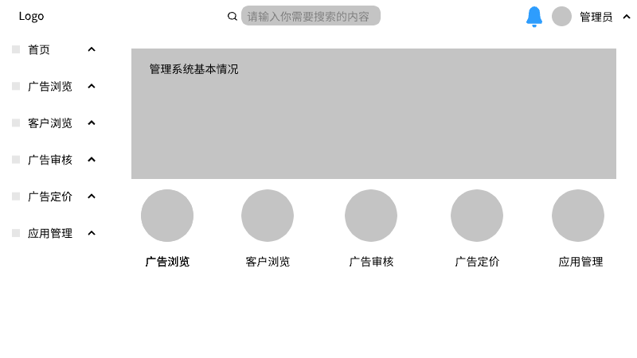
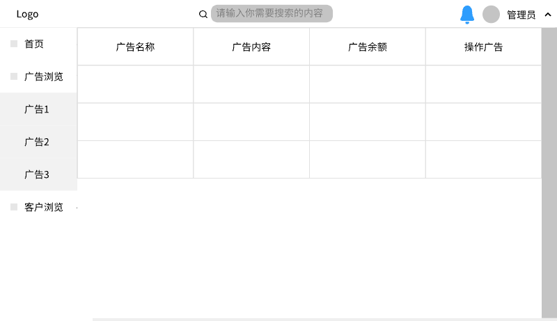
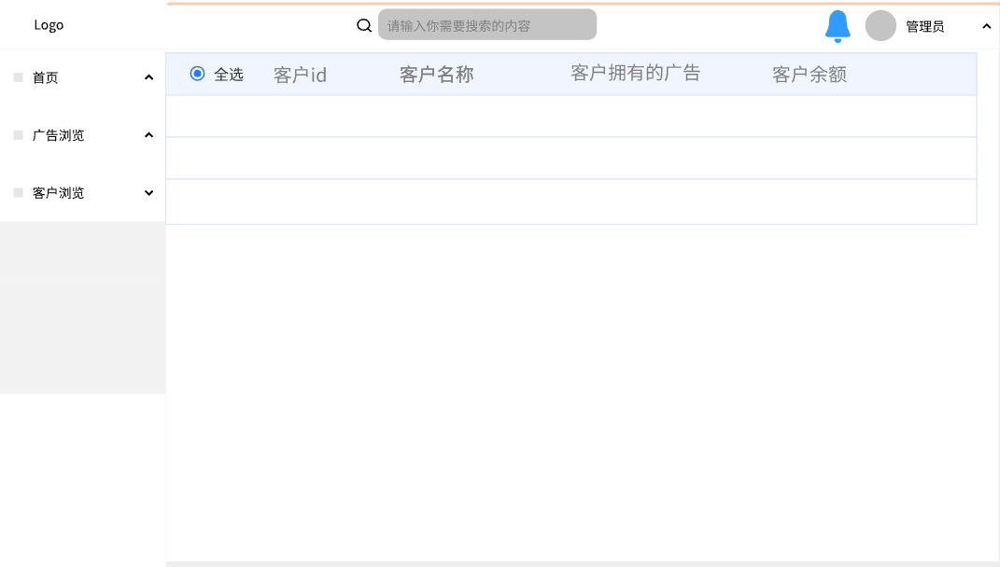
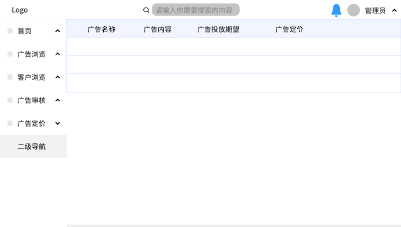
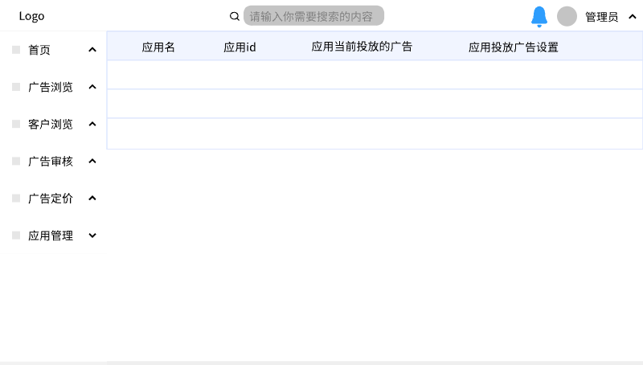

# 界面设计文档

## 用户平台

### 登录系统

- 用户可以点击第一个文本框输入用户名
- 用户可以点击第二个文本框输入密码
- 用户可以在忘记密码时点击文本框下方"忘记按钮"进入重置密码页面
- 用户可以点击登录按钮进入平台首页
- 用户可以点击右上方注册按钮进入注册页面

### 注册系统

- 用户可以点击第一个文本框输入用户名
- 用户可以点击第二个文本框输入密码
- 用户可以点击第三个文本框输入确认密码
- 用户可以点击注册按钮进行注册并进入登录页面
- 用户可以点击右上方登录按钮直接进入注册界面

### 顶部导航栏

- 用户可以点击左侧Logo跳转到首页
- 用户可以点击右侧购物车图标跳转到购物车页面
- 用户鼠标悬浮在右侧消息图标可看到最新收到的消息，点击可以跳转到消息页面
- 用户可以点击用户头像跳转到用户个人页面

### 首页

- 用户可以在首页中看到自己所创建的广告列表
- 用户可以通过每个广告卡片看到该广告的基本信息及状态（如展示中，审核中，待付费，待展示等状态）
- 用户可以点击广告卡片跳转到广告详情页面
- 用户可以点击右上方刷新图标刷新广告信息
- 用户可以点击创建广告按钮新建广告
- 用户可以点击左侧广告展示数据跳转到广告展示数据页面

### 广告详情页

- 用户可以在广告详情页中看到广告标题、广告描述、广告三端预览效果等信息
- 用户可以在广告搭建栏看到当前广告的状态及待执行的操作
- 用户可以点击广告搭建栏中对应选项进行对应的操作
- 当广告被创建成功时（即能通过首页跳转到该广告详情页），初始化广告信息这一操作就会被标记为已完成

### 广告展示数据页

- 用户可以在核心数据中看到当前展示广告的累计查看次数，累计点击次数，点击率等数据
- 用户可以在实时数据中通过左侧折线图看到不同时间段中广告的查看次数、点击次数、点击率等数据的变化趋势
- 用户可以在实时数据中通过右侧柱状图看到广告分别在pc，android，小程序中的查看次数、点击次数等数据

### 个人详情页

- 用户可以点击用户名文本框修改用户名
- 用户可以点击真实姓名文本框输入真实姓名
- 用户可以点击电话文本框输入/修改电话
- 用户可以点击公司名文本框输入/修改公司名
- 用户可以点击公司地址文本框输入/修改公司地址
- 用户可以点击公司电话输入/修改公司电话
- 用户可以点击核心信息框右上方的保存按钮对修改信息就行保存
- 用户可以点击左侧侧边栏中的账号信息框进入个人账号页
  
### 个人账号页

- 用户可以点击充值按钮进入充值页面进行充值
- 用户可以点击流水记录框进行详细流水查询
- 用户可以点击做出侧边栏中的基本信息框进入个人详情页

### 购物车

- 用户可以在查询栏按关键字查询购物车里的商品信息
- 用户可以点击全选复选框来选中所有商品
- 用户可以点击加减号来增加购买数量
- 用户可以点击时长下拉框选择购买时长
- 用户可以点击删除按钮来删除对应的商品
- 用户可以点击查看明细查询具体费用明细

### 消息中心

- 用户可以点击全部消息下拉菜单查询未读消息和已读消息
- 用户可以点击未读消息或已读消息进入到指定消息界面
- 用户可以根据标题关键字进行搜索消息
- 用户可以点击信息标题进行详细查询
- 用户可以选中消息然后点击删除、已读等操作

## 管理平台

### 管理系统首页

- 管理员可以通过首页中管理系统基本情况查看系统的使用情况，流水等统计信息
- 管理员可以通过广告浏览按钮跳转到相应界面
- 管理员可以通过客户浏览按钮跳转到相应界面
- 管理员可以通过广告审核按钮跳转到相应界面
- 管理员可以通过广告定价按钮跳转到相应界面
- 管理员可以通过应用管理按钮跳转到相应界面

### 广告浏览

- 管理员可以通过广告浏览界面查看展示广告的名称，内容，余额等信息
- 管理员可以对展示的广告进行操作
- 管理员可以点击广告名称/内容跳转到广告详情界面
- 管理员可以通过点击广告余额跳转到广告流水数据统计界面

### 客户浏览

- 管理员可以通过客户浏览界面查看客户信息
- 管理员可以通过该界面对客户进行操作
- 管理员可以点击客户名称跳转到客户信息详情界面
- 管理员可以点击客户拥有的广告跳转到广告详情界面

### 广告审核

- 管理员可以通过广告审核界面查看待审核的广告
- 管理员可以点击广告内容跳转到广告详情页
- 管理员可以点击广告投放者跳转到客户详情界面
- 管理员可以查看广告审核状态
- 管理员可以对待审核的广告进行审核

### 广告定价

- 管理员可以通过广告定价界面查看待定价和已定价的广告
- 管理员可以点击广告名称/内容跳转到广告详情页
- 管理员可以产看广告投放期望收益等信息
- 管理员可以根据广告内容以及期望确定广告定价

### 应用管理

- 管理员可以通过应用管理界面查看合作投放广告的应用
- 管理员可以通过应用管理界面查看正在投放的广告等信息
- 管理员可以点击应用当前投放的广告跳转到广告详情页
- 管理员可以点击应用投放广告设置来对正在投放的广告进行操作
