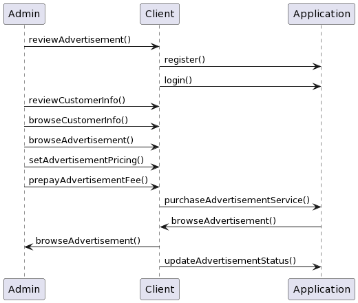
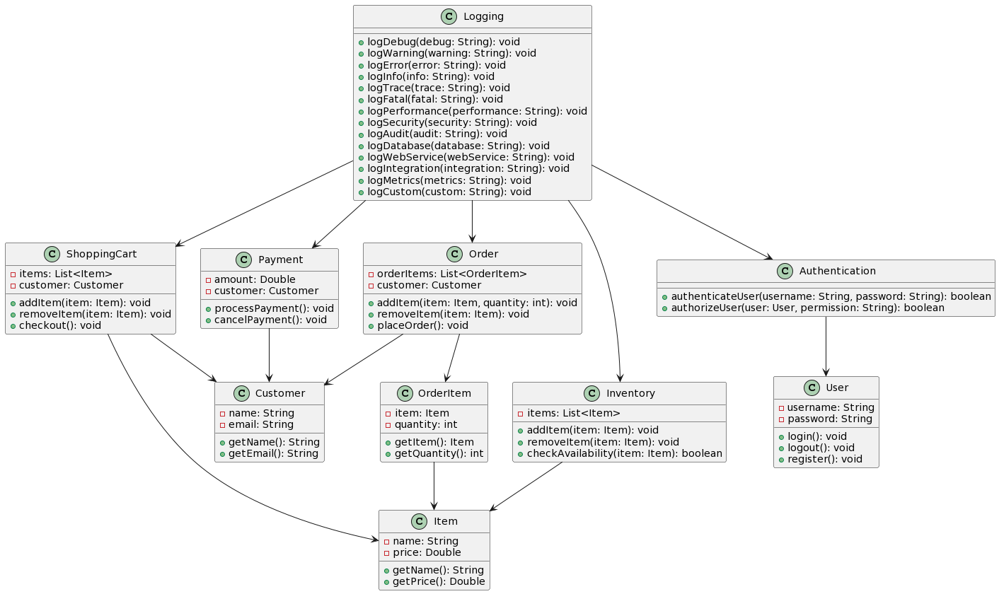
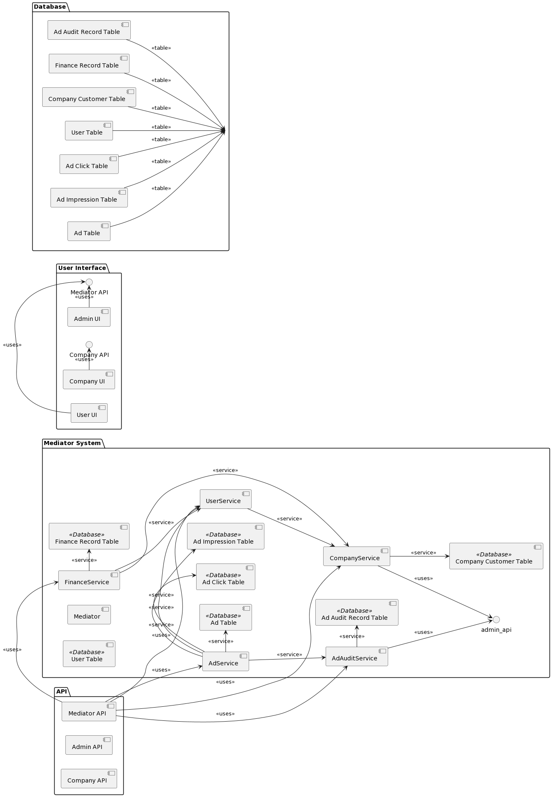
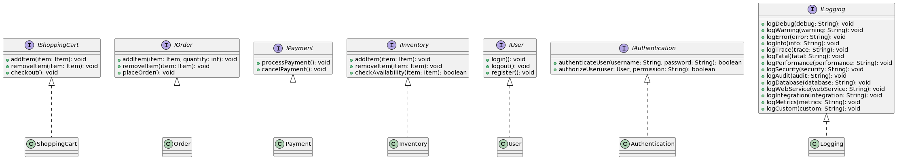
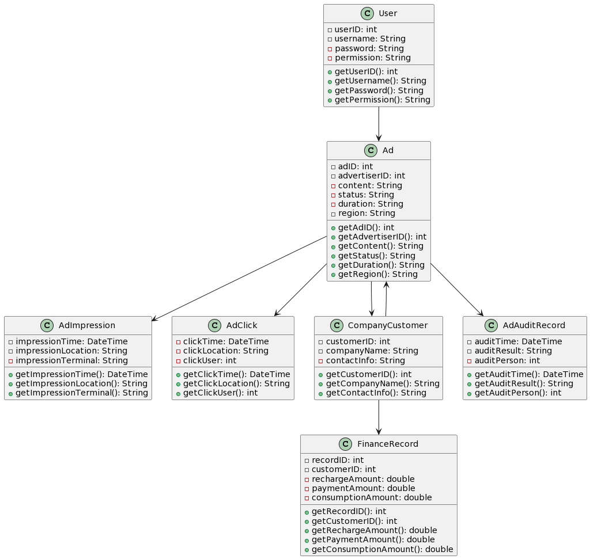

# 系统设计

## 设计思想

三层架构(3-tier architecture) 通常意义上的三层架构就是将整个业务应用划分为：界面层（User Interface layer）、业务逻辑层（Business Logic Layer）、数据访问层（Data access layer）。区分层次的目的即为了“高内聚低耦合”的思想。3个层次中，系统主要功能和业务逻辑都在业务逻辑层进行处理。

## 系统主要业务流程设计

## 功能组件划分

如下图所示：

### 组件描述

- UI:
该模块用户可见，是系统和用户之间进行交互和信息交换的媒介，它实现信息的内部形式与人类可以接受形式之间的转换。

- 系统管理:
该模块是整个系统核心，它的关注点主要集中在业务规则的制定、业务流程的实现等与业务需求有关的系统设计

- 数据库:
数据库是“按照数据结构来组织、存储和管理数据的仓库”用来收集用户所填信息，注册信息及一切有关数据，对系统提供数据支持

## 接口设计

接口的变化，对于外部的表现来看，无非是输入和输出的变化，在实际的软件工程中，由于需求的变更，软件功能和规格的变化，接口的变化也在所难免，如何将修改的影响降低，在设计中还是有些方法来使用。

应对输入变化的场景：

（1）尽量不要用参数的个数来变化；

（2）使用无值型的指针，通过强制转换来适应不同的结构体，同样保证了接口的兼容性，接口参数使用字符串，通过规范字符串的格式来进行不同参数的修改和传递，保证接口不变化，有点类似数据结构的方式，URL字串使用就是典型的方式。

应对输出变化的场景：

（1）返回数据的定义需要进行规范，常用的方式是返回错误码；

（2）返回数据指针；

（3）返回数据结构/类。

## 5. 数据库设计概述

### 5.1 数据库环境说明

MySQL是一种关系型数据库管理系统，关系型数据库将数据保存在不同的表中，而不是将所有数据放在一个大仓库内，这样就增加了速度并提高了灵活性。这次采用的是开发设计工具是MySQL 8.0版本。

### 5.3 表汇总说明

- 广告表（Ad Table）：用于存储广告的信息，包括广告ID、广告主ID、广告内容、广告状态、投放时段、地域等。广告表可以记录广告的基本信息，并与其他表进行关联。

- 广告展示记录表（Ad Impression Table）：用于存储广告展示的记录，包括展示时间、展示位置、展示终端等信息。广告展示记录表可以用于统计广告的展示次数，并生成报告。

- 广告点击记录表（Ad Click Table）：用于存储广告点击的记录，包括点击时间、点击位置、点击用户等信息。广告点击记录表可以用于统计广告的点击次数，并生成报告。

- 用户表（User Table）：用于存储用户的信息，包括用户ID、用户名、密码、权限等。用户表可以用于实现用户认证和授权功能。

- 企业客户表（Company Customer Table）：用于存储企业客户的信息，包括企业客户ID、企业名称、联系信息等。企业客户表可以用于管理企业客户的信息，并与广告表进行关联。

- 财务记录表（Finance Record Table）：用于存储企业客户的财务记录，包括充值记录、支付记录、消费记录等。财务记录表可以用于查询企业客户的账户余额和消费明细。

- 广告审核记录表（Ad Audit Record Table）：用于存储广告审核的记录，包括审核时间、审核结果、审核人等信息。广告审核记录表可以用于记录广告的审核历史。